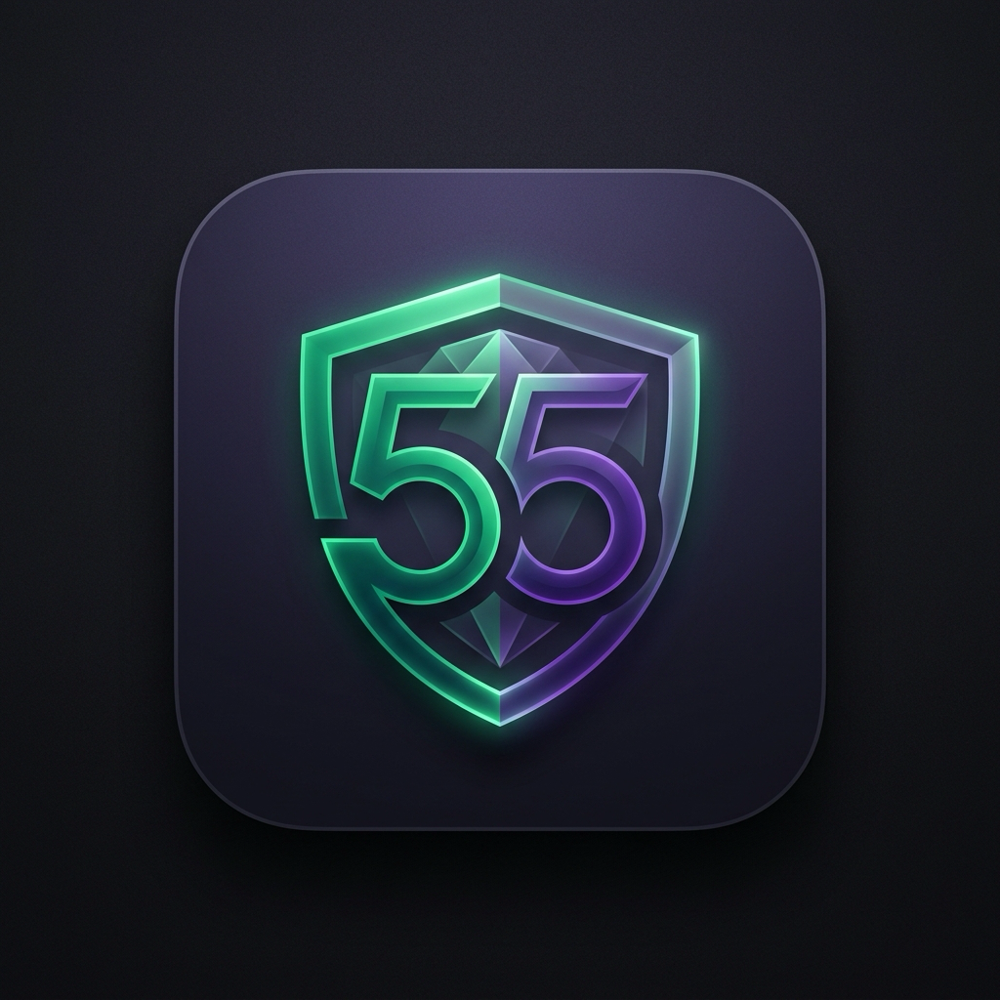

<div align="center">
  
  <h1>Cầm Đồ 55</h1>
  <p><strong>Hệ Thống Quản Lý Cầm Đồ Hiện Đại & Bảo Mật</strong></p>
  <p>
    
    
    
    
  </p>
</div>

---

## 🌟 Giới thiệu

**Cầm Đồ 55** là một ứng dụng Desktop đa nền tảng (macOS & Windows) được thiết kế chuyên biệt để quản lý nghiệp vụ cầm đồ. Với giao diện tối giản, sang trọng (chuẩn BigTech) và hiệu năng cực cao, phần mềm giúp các chủ tiệm kiểm soát hợp đồng, theo dõi dòng tiền và quản lý khách hàng một cách thông minh, tự động hoá.

## ✨ Tính năng nổi bật

- 📊 **Bảng điều khiển (Dashboard) trực quan**: Cập nhật số liệu kinh doanh, quỹ tiền mặt, và tổng dư nợ theo thời gian thực.
- 📝 **Quản lý hợp đồng trọn đời**: Theo dõi trạng thái hợp đồng (Đang vay, Quá hạn, Đã thanh lý, Đã tất toán) với hệ thống thẻ Kanban.
- 💰 **Tự động tính lãi suất**: Công thức tính lãi chuẩn xác, hỗ trợ nhiều hình thức đóng lãi.
- 🤖 **Trợ lý AI Telegram**: (Đang phát triển) Tra cứu nhanh hợp đồng và tình hình kinh doanh thông qua bot Telegram thông minh.
- 🔄 **Cập nhật tự động (Auto-Updater)**: Ứng dụng tự động kiểm tra và tải về phiên bản mới nhất một cách bảo mật với chữ ký điện tử Minisign.
- 🔐 **Bảo mật & Cục bộ**: Cơ sở dữ liệu SQLite được lưu trữ mã hoá trực tiếp trên máy tính cá nhân của bạn, không lo rò rỉ dữ liệu lên đám mây.

## 🚀 Hướng dẫn cài đặt

Vì đây là ứng dụng mã nguồn kín (Private), bạn có thể tải bản cài đặt chính thức từ trang Releases của dự án:

1. Truy cập vào mục **[Releases](../../releases/latest)** trên GitHub.
2. Tải về file có đuôi `.dmg` (Ví dụ: `C.m.D.55_1.0.0_aarch64.dmg`).
3. Mở file cài đặt và làm theo hướng dẫn trên màn hình.
4. Mở ứng dụng từ Desktop hoặc Launchpad.

> **⚠️ Xử lý lỗi "App is damaged" trên macOS:** 
> Vì ứng dụng chưa được ký bằng tài khoản Apple Developer trả phí, macOS có thể chặn mở ứng dụng. Để khắc phục triệt để, bạn mở ứng dụng **Terminal** trên Mac và chạy lệnh sau (nhập mật khẩu máy tính nếu được yêu cầu):
> ```bash
> sudo xattr -cr /Applications/CamDo55.app
> ```

## 🛠 Ngăn kéo Công nghệ (Tech Stack)

Dự án được xây dựng trên những công nghệ hiện đại và tối ưu nhất:
- **Core Engine:** [Tauri v2](https://v2.tauri.app/) (Rust) - Tối ưu hoá dung lượng và bảo mật nền tảng.
- **Frontend UI:** React 18 + Vite + TypeScript.
- **Styling:** TailwindCSS + Lucide Icons + Biểu đồ Recharts.
- **Database:** SQLite (tauri-plugin-sql).
- **CI/CD:** Tự động build và ký điện tử (Code Signing) bằng Github Actions.

---
*Phát triển độc quyền cho Hệ thống Cầm Đồ 55.*
